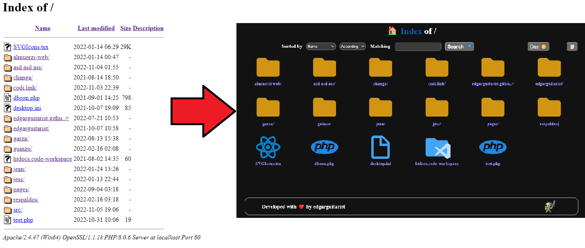

# better-xampp-htdocs-folder

XAMPP by default has been bringing a default page which is already more than outdated. ❌

This page is generated automatically so it has had to be hydrated with CSS, PHP and JS without breaking the old page and its limited functionality, adding the new ones above. ✔️

## What's New? 👀

- [better-xampp-htdocs-folder](#better-xampp-htdocs-folder)
  - [What's New? 👀](#whats-new-)
    - [Installation ⚙️](#installation-️)
    - [Better Breadcrumb 🍞](#better-breadcrumb-)
    - [Personalization Icons 👽](#personalization-icons-)
    - [Dark Mode 🌙](#dark-mode-)
    - [Search 🔎](#search-)
    - [Grid View 📅](#grid-view-)
  - [What I think? 🤯](#what-i-think-)

### Installation ⚙️

For the installation you only need to put the src folder and the .htaccess file at the root of the XAMPP htdocs folder.

### Better Breadcrumb 🍞

The original breadcrumb was recreated but adding the possibility of working as a good breadcrumb and allowing return to the selected point.

### Personalization Icons 👽

The customization of the icons has been thanks to reusing the icons of [Material Icon Theme], but they can be modified by adding them to the src/icons/ folder and then modifying the .htaccess file where it is referring to the extension of the file whose icon you want to modify.

eg.

```sh
AddIcon /src/icons/image.svg .jpg .png .gif .tif .tiff .jpeg .bmp
```

### Dark Mode 🌙

This has been created by changing the color-scheme to dark and adding styles for unique or new parts that were not supported by default.

It was also possible to make the select mode persist and not change when changing the current route or doing a search.

### Search 🔎

This functionality comes by default with the xampp page but it is not shown, so it is necessary to define the form and with it, functionalities and persistence of the selection to search were added.

> Note: By default, the search text must completely match the file to be searched for,both the name and the extension, eg. --> ```"test.php"```

I hope I can solve it in the future and making a more powerful searcher.

### Grid View 📅

To achieve this, the default form that xampp had to display was transformed to the Fancy List view mode and it was completely modified to have a grid view with all the elements of the current route.

## What I think? 🤯

Keeping the default page is a problem, which I hope I can handle in the future in another way, or just keep adding new features in the meantime.

This project was done in a weekend so there is still a lot to do, if you want to contribute you are welcome.

Finally I think it's a great progress to go from this to this...



<h2>Developed with ❤️ by edgarguitarist</h2>

[Material Icon Theme]:<https://marketplace.visualstudio.com/items?itemName=PKief.material-icon-theme>
